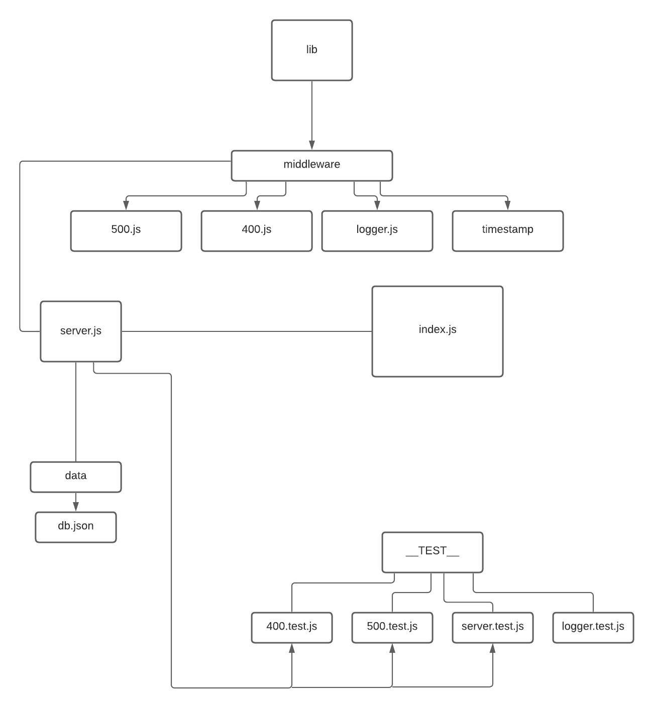
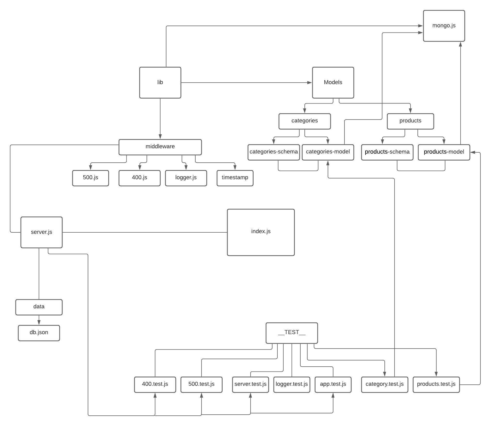

# api-server
## ---------------------------------------- Class-06 -----------------------------------------

[pull request](https://github.com/Hidayasyam-a401-advanced-javascript/api-server/pull/1)

[Swagger link](https://app.swaggerhub.com/apis/HidayaSyam/default-title/0.1)

## --------------------------------------- Class-07 -------------------------------------------

 [pull request](https://github.com/Hidayasyam-a401-advanced-javascript/api-server/pull/3)

[Swagger link](https://app.swaggerhub.com/apis/HidayaSyam/class07/0.1)

## UML 

[UML](https://app.lucidchart.com/invitations/accept/d9014339-0500-4cee-9f6d-946f3f363c46)

## --------------------------------------- Class-07 -------------------------------------------

